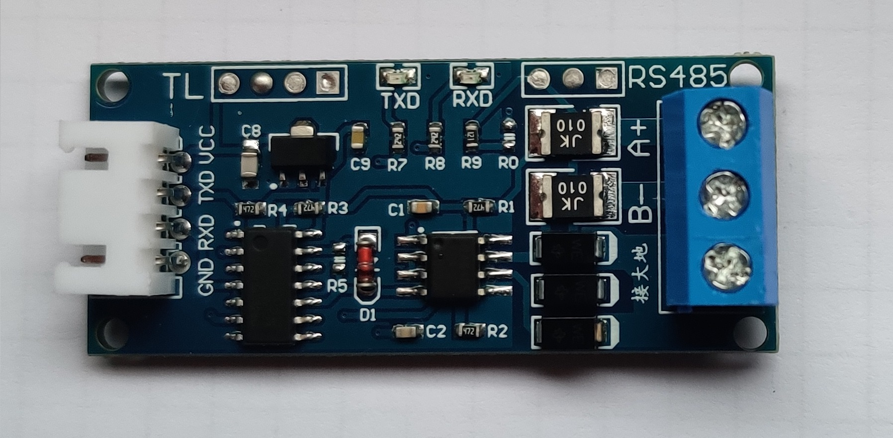
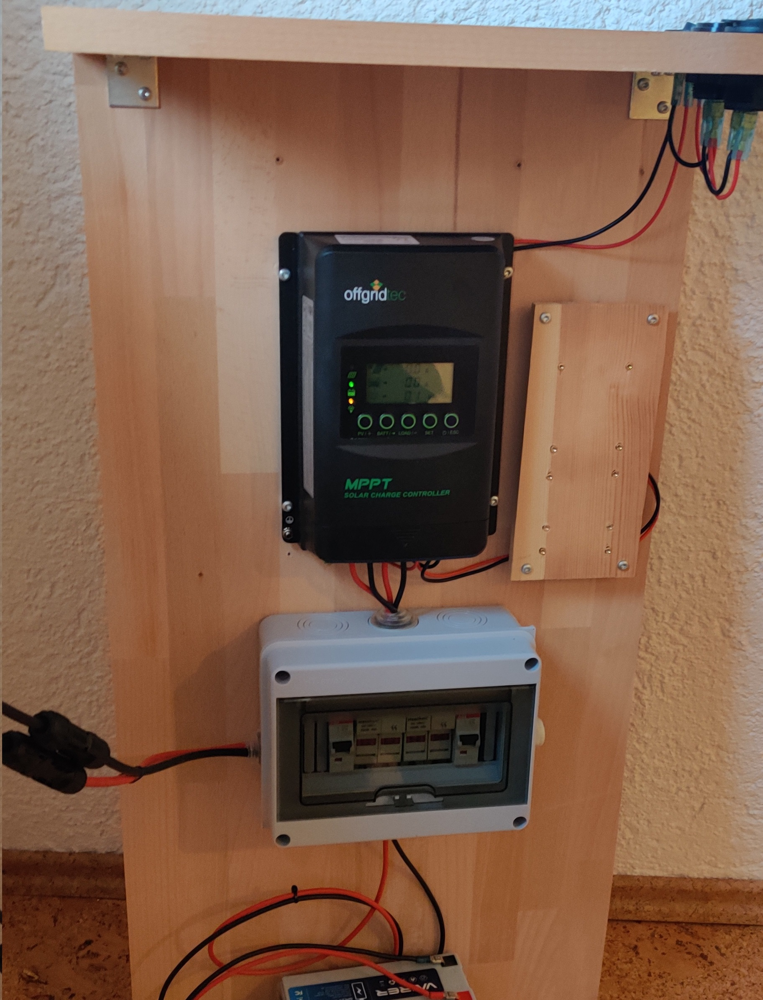
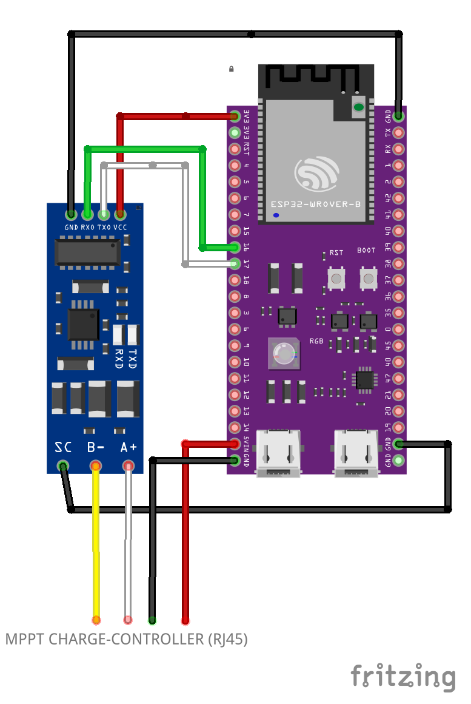
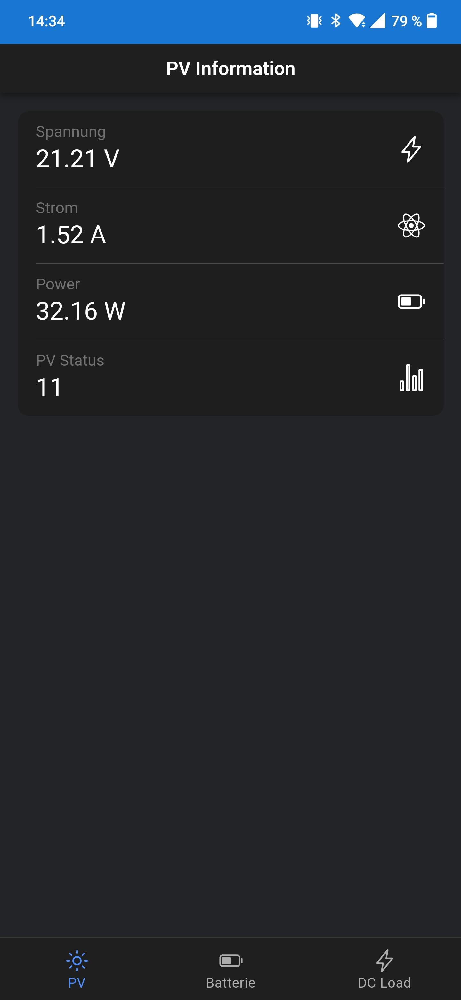
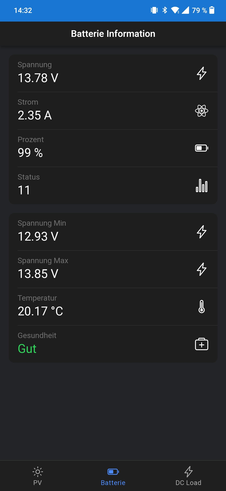
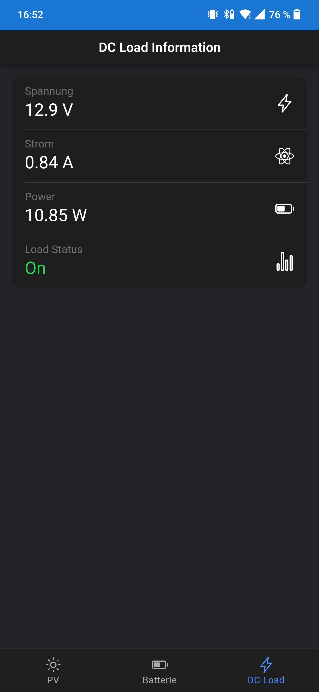

# SmartPV

This project can be used to transmit a solar charge controller via Modbus.
With the help of an ESP32S3 and the Modbus RTU protocol, it is possible to read out the data of an e.g. EPEVER MPPT charge controller
All read-out data is then hosted on a WebSocketServer which is located on the ESP32.
The client, which is also located on the ESP32, can then query the data from the SocketServer and displays it.
The client is also a PWA and caches all the necessary data, the client is only designed for smartphones and can also be installed on the smartphone with an SSL connection.
An example `nginx.config` is included for this purpose

By the way, you can charge power banks, tablets or even smartphones with this project. All devices that require DC 12 V or DC 5 V for operation.

# Prerequisites

I used:

- Offgridtec MPPT PRO-X 20A Laderegler 12V/24V
- Offgridtec OLP 70W 12V Solarpanel
- VATRER POWER 12V 7AH LiFePO4
- DC 12V converter to USB DC 5V socket
- ESP32-S3-WROOM-1 (N16R8) with 16MB flash memory
- TTL zu RS485 Converter Modul
- some fuses (to protect the solarpanel and battery)
- wires (6 mm2)

I have taken everything from the manufacturer's documentation and connected everything accordingly

**Warning**

If you don't feel safe doing this and don't have a plan for the wiring, don't do it

# Wiring

Use the RJ45 Port of the MPPT controller to make the following connections

`MPPT Controller (pin 1 +5V) -> ESP32(5Vin)`  
`MPPT Controller (pin 8 GND) -> ESP32(GND)` 

Connections from ESP to RS485

`ESP32(3.3V) ->  RS485(pin VCC)` 
`ESP32(GND) ->  RS485(pin GND)` 
`ESP32(pin 16 RX) ->  RS485(pin RXD)` 
`ESP32(pin 17 tX) ->  RS485(pin TXD)` 

Finally, the data connection between the controller and the RS485 module

`MPPT Controller (pin 4 B) -> RS485(B)` 
`MPPT Controller (pin 5 A) -> RS485(A)` 

By the way, I used a patch cable to connect the solar charge controller to the box, see images

# Client Installation

Go to the **client** directory and run

> npm install

to serve the Client run the command

> npm run start

to build the Client run

> npm run prod

the `dist` folder is created directly as a `data` folder in the esp32/SmartPV directory

# Arduino IDE

Open the Arduino IDE and open SmartPV.ino  
We need a larger SPIFFS for the client, we have to add a custom partition, using the CSV file delivered with the project.
compile the code and upload it to the ESP32
It is important that the client has already been built because in the next step the client can be uploaded to the ESP32 controller with the help of the LittleFS upload tool

# Upcoming features

- changing the language in the client(Recognise automatically)
- Switching on the load via the client
- refactoring of SocketServer(in a separate library)
- refactoring of modbus lib (for a better error handling)
